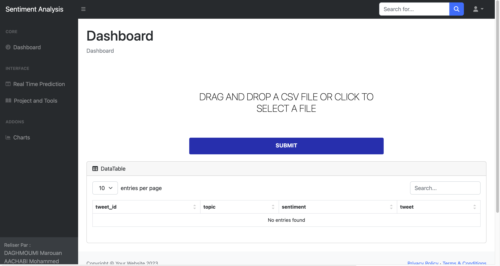
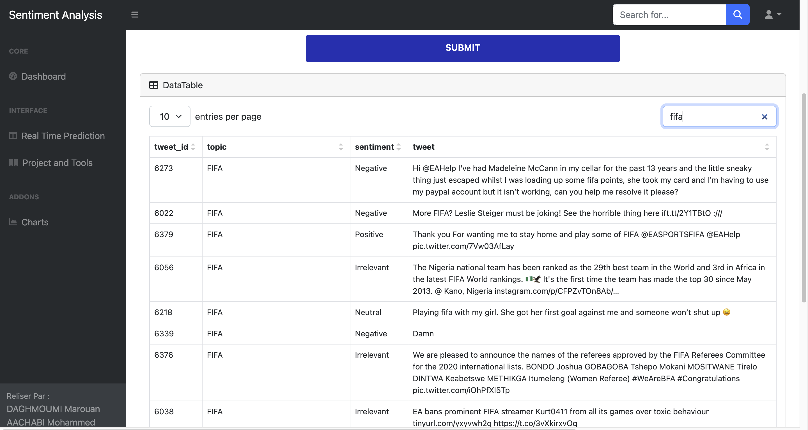
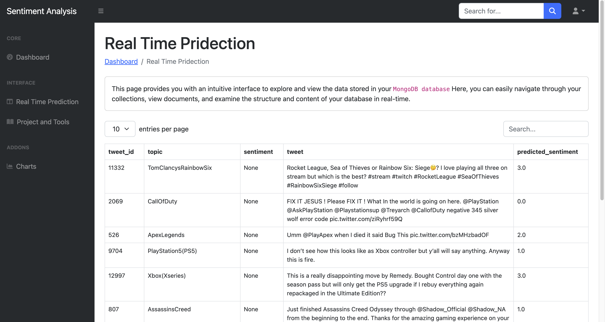
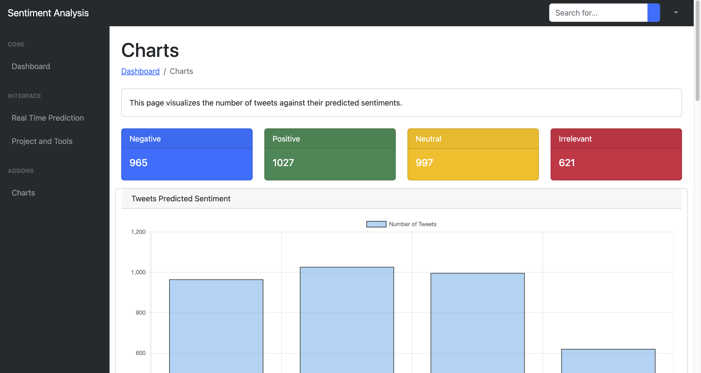

# Twitter Sentiment Analysis


## Application Structure
```bash
Twitter_sentiment/
│
├── static/ # Contains static files like CSS, JavaScript, and images
│
├── templates/ # Contains HTML templates
│
├── uploads/ # Directory for uploaded files
│
├── app.py # Flask application file
│
├── consumer/ # Consumer scripts for Kafka
│ ├── lrmodel # Directory for logistic regression model
│ └── consume.py # Kafka consumer script
│
├── Model/ # Directory for ML model related files
│ ├── LrModel/ # Directory for logistic regression model files
│ ├── Pipline/ # Directory for pipeline files
│ ├── model.ipynb # Jupyter notebook for model training
│ ├── twitter_training.csv # Training dataset
│ └── twitter_validation.csv # Validation dataset
│
├── venv/ # Virtual environment directory
│
├── Twitter_sentiment.iml # IntelliJ IDEA project file
│
└── zk-single-kafka-single.yml # Kafka configuration file
```
## Steps to Run the Application
1. Clone the repository:
```bash
git clone git@github.com:Marouan19/Twitter_sentiment.git
```

2. Download Kafka by executing the following command:
```bash
wget https://raw.githubusercontent.com/simplesteph/kafka-stack-docker-compose/master/zk-single-kafka-single.yml
```

3. Start Kafka and Zookeeper using Docker Compose:
```bash
docker-compose -f zk-single-kafka-single.yml up -d
```

4. Access Kafka by executing the following command:
```bash
docker exec -it <kafka-container-id> /bin/sh
```


5. Inside the Kafka container, create a topic using the following command:

```bash
kafka-topics --create --topic my_topic --bootstrap-server localhost:9092 --replication-factor 1 --partitions 1
```

6. Execute the Kafka consumer script:
```bash
python consumer/consume.py
```
7. Execute the Flask application:
```bash
python app.py
```
## Steps to predicte your data
1. Upload your data:
   


2. After upload data u should see your data



3. Go to predict in real time to see your data generated in real time



4. Go to chart to see statistics


## Team
- Marouan Daghmoumi
- Mohammed Aachabi

## Supervised By
- Prof. Yasyn El Yusufi
